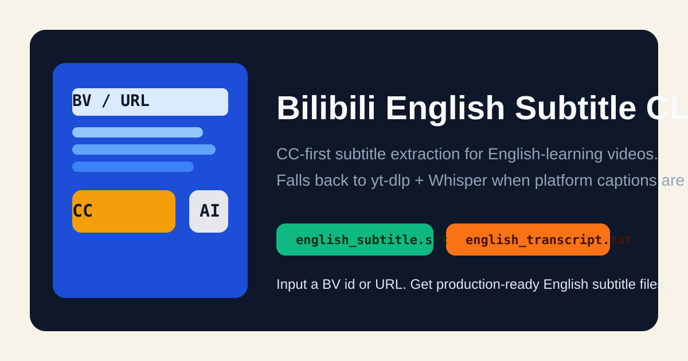

<p align="center">
  
</p>

<p align="center">
  
  
  
  
  
</p>

<p align="center">
  Extract English subtitles from Bilibili videos with a CC-first workflow.
  <br>
  If platform English captions are unavailable, the CLI falls back to <code>yt-dlp + Whisper</code> and writes both <code>.srt</code> and plain-text transcript outputs.
</p>

## Why This Exists

Bilibili is full of English-learning content, but subtitle availability is inconsistent across videos and pages. This project turns that into a predictable workflow:

- Use platform English CC when it exists
- Fall back to local Whisper transcription when it does not
- Keep the interface simple: input a `BV` ID or URL, get `english_subtitle.srt` and `english_transcript.txt`

## Features

- CC-first extraction using Bilibili metadata APIs
- Automatic fallback to `yt-dlp + Whisper`
- Works with `BV` IDs, standard video URLs, and `?p=` page selection
- Clean `argparse` CLI with explicit error messages
- macOS-friendly setup
- Unit tests and GitHub Actions CI

## Quick Start

Install `ffmpeg` first:

```bash
brew install ffmpeg
```

Create a virtual environment and install dependencies:

```bash
python3 -m venv .venv
source .venv/bin/activate
python3 -m pip install -r requirements.txt
```

Run against the target video:

```bash
python3 bili_subtitle_cli.py 'https://www.bilibili.com/video/BV1UbyZB9ERb'
```

Or install the project as a package:

```bash
python3 -m pip install .
bili-english-subtitle 'https://www.bilibili.com/video/BV1UbyZB9ERb'
```

## Usage

```bash
python3 bili_subtitle_cli.py VIDEO_OR_BV
```

Common examples:

```bash
python3 bili_subtitle_cli.py BV1UbyZB9ERb
python3 bili_subtitle_cli.py 'https://www.bilibili.com/video/BV1UbyZB9ERb?p=3'
python3 bili_subtitle_cli.py BV1UbyZB9ERb --page 3 --whisper-model small.en
python3 bili_subtitle_cli.py BV1UbyZB9ERb --output-dir output
python3 bili_subtitle_cli.py BV1UbyZB9ERb --force-whisper
```

CLI help:

```text
usage: bili_subtitle_cli.py [-h] [-p PAGE] [-o OUTPUT_DIR]
                            [--whisper-model WHISPER_MODEL]
                            [--device {auto,cpu,cuda,mps}]
                            [--timeout TIMEOUT] [--force-whisper]
                            video
```

## How It Works

1. Parse a `BV` ID or Bilibili URL.
2. Resolve the target page and `cid` through the Bilibili `view` API.
3. Check the Bilibili `player` API for English subtitle tracks.
4. If English CC exists, download and convert it to SRT.
5. If not, use `yt-dlp` to fetch media and transcribe it locally with Whisper.

## Output Files

- `english_subtitle.srt`
- `english_transcript.txt`

The transcript file stores one subtitle segment per line. This makes it easy to feed into note-taking, LLM, or flashcard workflows.

## Development

Install dev dependencies:

```bash
python3 -m pip install -e .[dev]
```

Run checks:

```bash
python3 -m ruff check .
python3 -m pytest
```

## Tested Example

The original target video is a multi-page playlist:

```text
https://www.bilibili.com/video/BV1UbyZB9ERb
```

The tool defaults to page 1 unless `--page` or `?p=` is provided.

## Limitations

- Whisper is forced into English transcription mode, so non-English audio will degrade accuracy.
- Some Bilibili videos require login or cookies for subtitle or media access.
- Multi-page videos are processed one page at a time.

## Legal

This project is not affiliated with Bilibili.

Only use it on videos you are permitted to access, transcribe, and store. Respect copyright, platform rules, and uploader rights.

## License

MIT. See [LICENSE](LICENSE).
